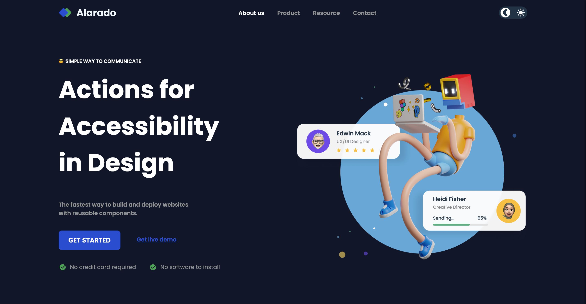

# DevChallenges Alarado landing page

## Description

This is a simple landing page for a fictional company called Alarado. The landing page is a challenge from [DevChallenges](https://devchallenges.io/). The challenge is to build a landing page that looks as close as possible to the design provided by DevChallenges. The design is responsive and has a dark mode. You can check the challenge [here](https://devchallenges.io/challenge/simple-hompage-alarado).

## Features

- Responsive design
- Dark mode
- Custom checkbox

## Technologies

- HTML
- CSS
- JavaScript
- CSS custom properties (variables for handling dark mode)

## Installation

1. Clone the repository
    
    ```bash
    git clone
    ```
2. Open the `index.html` file in your browser
3. Enjoy the landing page!

## Live Demo

[Alarado landing](https://)

## Screenshot

Desktop view


Mobile view


## Author

- [Robert Ramirez](https://robert-ramirez.co/)
- [LinkedIn](www.linkedin.com/in/roberto-ramirez-aguilar)